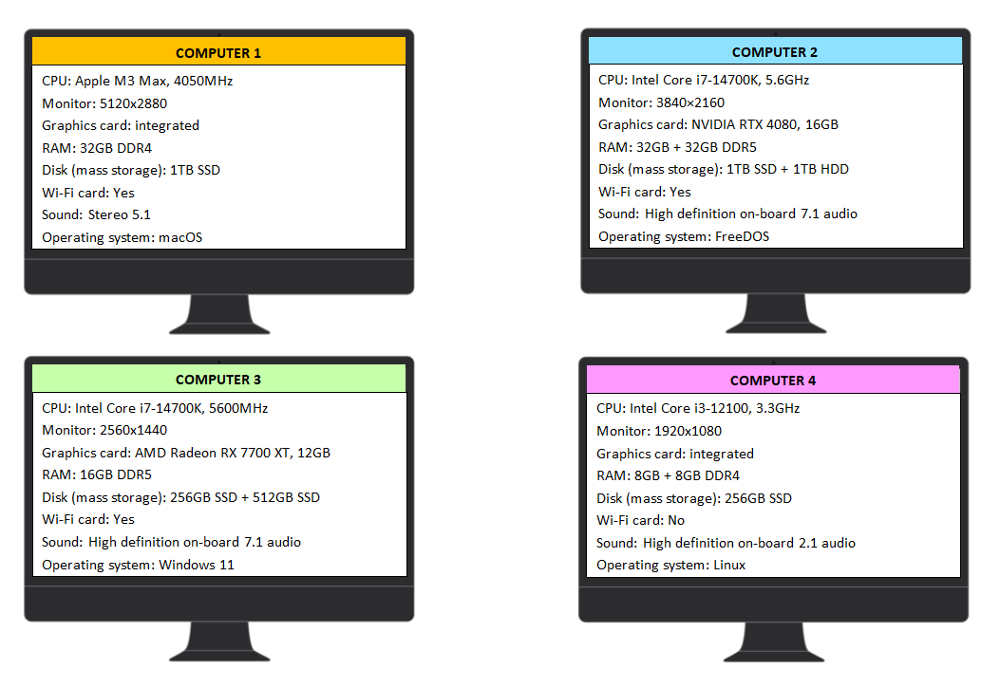

# Cuestionario: configuración del ordenador



```{mchoice}
:answer1: 1;
:answer2: 2;
:answer3: 3;
:answer4: 4;
:correct: 4

¿Al mirar el procesador, la memoria RAM y la tarjeta gráfica, cuál sería el ordenador más débil?
```

```{mchoice}
:answer1: 1;
:answer2: 2;
:answer3: 3;
:answer4: 4;
:correct: 2

¿Al mirar el procesador, la memoria RAM y la tarjeta gráfica, cuál sería el ordenador más potente?
```

```{mchoice}
:answer1: 1;
:answer2: 2;
:answer3: 3;
:answer4: 4;
:correct: 1

¿Cuál monitor tiene la mejor resolución?
```

```{mchoice}
:answer1: 1;
:answer2: 2;
:answer3: 3;
:answer4: 4;
:correct: 2

¿Cuál ordenador tiene más memoria RAM?
```

```{mchoice}
:answer1: 1;
:answer2: 2;
:answer3: 3;
:answer4: 4;
:correct: 4

¿Cuál ordenador proporciona la peor calidad de sonido?
```

```{mchoice}
:answer1: 1;
:answer2: 2;
:answer3: 3;
:answer4: 4;
:correct: 2,3

¿Cuál ordenador tiene el procesador más rápido?
```

```{mchoice}
:answer1: 1;
:answer2: 2;
:answer3: 3;
:answer4: 4;
:correct: 4

¿En cuál ordenador se puede almacenar la menor cantidad de datos?
```

```{mchoice}
:answer1: 1;
:answer2: 2;
:answer3: 3;
:answer4: 4;
:correct: 2

¿Cuál ordenador tiene la mejor combinación de discos para almacenar una gran cantidad de datos?
```

```{mchoice}
:answer1: 1;
:answer2: 2;
:answer3: 3;
:answer4: 4;
:correct: 4

¿Cuál ordenador no se puede conectar a una red inalámbrica?
```

```{mchoice}
:answer1: 1;
:answer2: 2;
:answer3: 3;
:answer4: 4;
:correct: 3

¿En cuál ordenador hay un sistema operativo Microsoft?
```